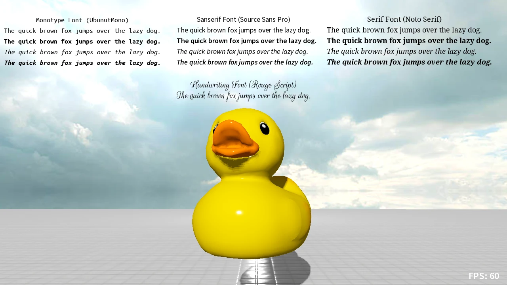
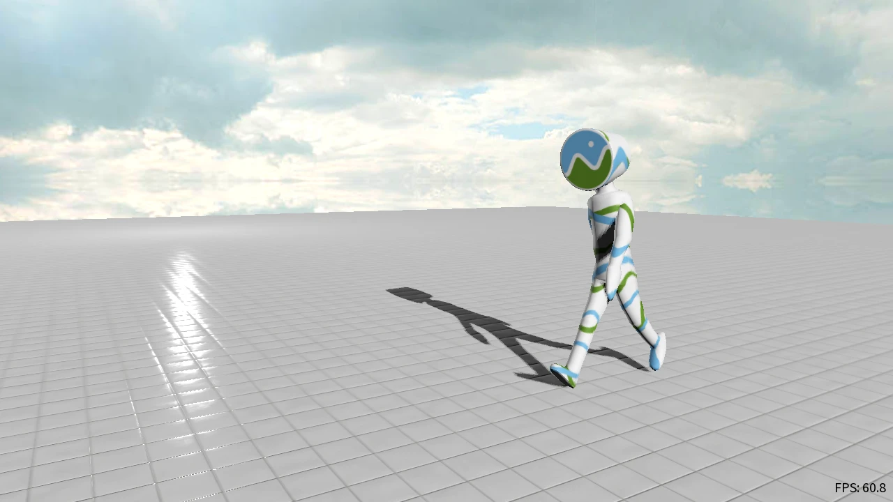

# CrossForge Example Scenes
These examples showcase the features of the framework. Click on the image to see the WebAssembly demo of the scene.

## Minimum Graphics Setup
This example shows how to set up the rendering pipeline for deferred shading, initializing the camera as well as loading and displaying a simple object.

    

## Skybox
A skybox is a nice feature to give you the impression of a wide scene. In this example you can switch through different skyboxes, adjust contrast, brightness, and saturation. The example also showcases how to combine deferred and forward rendering.

    

## Text Rendering
CrossForge comes with a default font package for serif, sans serif, monotype, and handwriting style as well as typefaces for regular, bold, and italic. In this example the different fonts are shown and you learn how to draw directly to the screen.

    

## Shapes and Materials
Basic shapes such as cubes, planes, spheres, and donuts can be created with varying tessellation by the CrossForges PrimitiveShapeFactory. Their appearance is strongly influenced by the applied material. This example shows how to create the different primitive shapes and apply default materials to them. The example also show how the appearance changes with different values of the physically based shading parameters metallic and smoothness.  

    

## Lighting
Lighting massively influences how a scene looks. This example shows the different light sources (directional, point, spot) on the famous Sponza scene. You can toggle the light sources on and off and experiment how each one contributes to the look and feel of the scene.

    

## Scene Graph
Using one or more graphs to structure the items of your scene makes it much more comfortable to work with and much more maintainable. This example shows how to create a tranquil forest scene using CrossForge's scene graph system.

    

## Skeletal Animation
Embedding a kinematic skeleton into a model or character allows for simple and complex rigid animations as required for human characters or moving machine parts. This example shows how to work with such animations in CrossForge.

    

## Morph Target Animation
Morph target animations are used for non-rigid deformations such as facial expressions caused by the contraction and relaxation of the underlying muscles. Weighted vector fields are added in the vertex shader to a base mesh in order to deform the surface. This example shows how to build a morph target model from a set of 3D meshes and how to apply animations to it.

    

## Multiple Viewports
Sometimes you need multiple camera perspectives on the same or different scenes. This example shows you how configure the rendering pipeline to achieve this.

    

