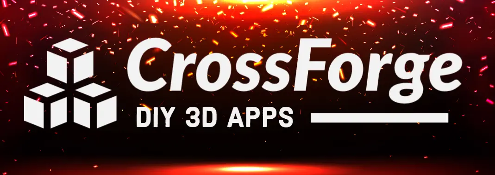
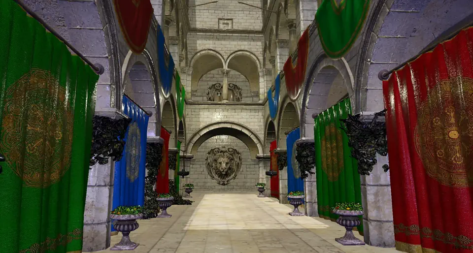
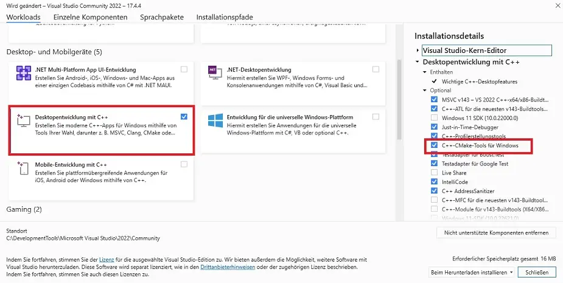
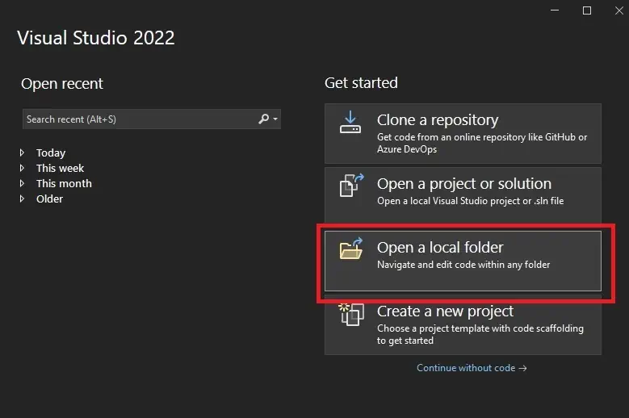
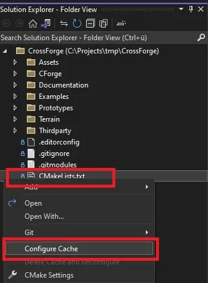

CrossForge: Your tool for cross-platform 3D-Apps <!-- {#mainpage} --> 
========================

    

 

 CrossForge is a cross platform graphics framework for 3D applications on Windows, Linux, and WebAssembly. It is primarily designed for educational purposes and computer graphics research. Hence it focuses solely on OpenGL as graphics API (no DirectX or Vulcan), and features extensive tutorials for computer graphics novices. If you want to learn how 3D application work from the ground up, you are at the right place.

# Why CrossForge?

- lot of very impressive open source graphic engines out there
- many of them support various graphics APIs (Vulcan/DirectX/OpenGL) and abstract away the underlying API
- CrossForge purely focuses on OpenGL with strong focus on compatibility with WebGL, so publication for web pages is a build-in feature
- this enables you to focus solely on a single graphics API and write your own code and shaders for it using popular and most widespread graphics API
- use the available modules, extend them, or replace them completely - the choice is yours!
- CrossForge is perfect for academic education and research in computer graphic

# Feature List
+ Supported systems: Windows, Linux, and WebAssembly
+ Physically based shading and material system
+ Deferred and forward rendering pipelines
+ Holistic self-configuring Shader system
+ Shadow mapping
+ Scene graph system
+ Skeletal and morph-target animations
+ Text rendering

See the examples to get a better impression of what CrossForge is capable of.

# Building CrossForge
## Setup
The following steps have to be performed, no matter what OS you are running.

1. If you haven't done already, install git <a href="https://git-scm.com/book/en/v2/Getting-Started-Installing-Git">https://git-scm.com/book/en/v2/Getting-Started-Installing-Git</a> and clone this repository with
>
>   git clone https://github.com/Tachikoma87/CrossForge.git
>
2. CrossForge relies on vcpkg as package manager on Windows and Linux <a href="https://github.com/microsoft/vcpkg">https://github.com/microsoft/vcpkg</a>. Follow the installation instructions for your system: <a href="https://github.com/microsoft/vcpkg#getting-started">https://github.com/microsoft/vcpkg#getting-started</a>

## Windows
The recommended tool for building CrossForge on Windows in Visual Studio. Download your preferred version from <a href="https://visualstudio.microsoft.com">https://visualstudio.microsoft.com</a> and make sure you select **C++CMake Tools for Windows** during installation. You can also add the CMake Tools using the Visual Studio Installer, if Visual Studio is already installed:

 

Now we need vcpkg to work with Visual Studio. Open a command prompt and type

    > [path-to-vcpkg]\vcpkg integrate install

Start Visual Studio and select **Open a local folder**. Move to the directory where you executed the first git command and open the **CrossForge** folder. If the CMake configuration process does not start automatically right click on **CMakeLists.txt** and select **configure cache**. Wait for the configuration to complete, then select **Build->Build All (F7)** from the menu bar. After completion select *CForgeSandbox.exe* as starting item and select **Debug->Start Debugging (F5)** from the menu bar or click on the small green right facing arrow.

| | |

## Linux
CrossForge uses vcpkg in manifest mode, which means that dependencies should be installed automatically. Run the following commands from the top directory to build the software:

    > cmake -B out/build-lin -S . "-DCMAKE_TOOLCHAIN_FILE=[path-to-vcpkg]/scripts/buildsystems/vcpkg.cmake"
    > cmake --build out/build-lin

And run the sandbox with

    > cd out/build-lin
    > ./CForgeSandbox

## Emscripten
Install emscripten by following <a href="https://emscripten.org/docs/getting_started/downloads.html">https://emscripten.org/docs/getting_started/downloads.html</a>. 
Open a command console and change directory to CrossForge folder.
From top directory run
    
    > [path-to-emsdk]/emsdk activate latest
    > emcmake cmake -DWEBP_USE_THREAD=OFF -B out/build-ems -Wno-dev  
    > cmake --build out/build-ems

To test the created website you will need a local webserver. You can create one on WSL or Linux following this tutorial: <a href="https://ubuntu.com/tutorials/install-and-configure-apache#1-overview">https://ubuntu.com/tutorials/install-and-configure-apache#1-overview</a>

 ## WSL
1. Prepare WSL and Visual Studio for a remote connection: <a href="https://learn.microsoft.com/en-us/cpp/linux/connect-to-your-remote-linux-computer?view=msvc-170">https://learn.microsoft.com/en-us/cpp/linux/connect-to-your-remote-linux-computer?view=msvc-170</a>

2. By default WSL does not come with graphics. You can configure your WLS with graphics and audio using this guide: <a href="https://research.wmz.ninja/articles/2017/11/setting-up-wsl-with-graphics-and-audio.html">https://research.wmz.ninja/articles/2017/11/setting-up-wsl-with-graphics-and-audio.html</a>. 

3. Then install and start xfce4 (or any other graphical desktop you like)

        > sudo apt-get install xfce4
        > startxfce4

1. Open Visual Studio and the CrossForge project. 
2. In the CMake Settings **(Project->CMake Settings for ...)** add the Linux-GCC-Debug and/or Linux-GCC-Release as target. 
3. Choose the WSL connection as Remote machine name.
4. Switch to a Linux-GCC target and wait for the CMake configuration to finish
5. Build the project **(F7)**
6. Run the project **(F5)**. The window will open in the xfce4 desktop.

# How to cite:

    @misc{CForge,
        title={CrossForge: A Framework for Building Cross-Platform 3D Applications},
        author={Tom Uhlmann and Contributors},
        year = {2020-2023},
        howpublished = {https://github.com/Tachikoma87/CrossForge},
    }

# Credits

+ Logo-Background: <a href="https://www.freepik.com/free-vector/burst-effect-with-falling-fire-sparks_30800556.htm#query=blacksmith&position=39&from_view=search&track=sph">Image by upklyak</a> on Freepik
+ Default Fonts by Google Fonts <a href="https://fonts.google.com/">https://fonts.google.com/</a>
+ PRR materials from ambientCG: <a href="https://ambientcg.com/">https://ambientcg.com/</a>
+ 3D models from the Khronos gltf samples repository: <a href="https://github.com/KhronosGroup/glTF-Sample-Models">https://github.com/KhronosGroup/glTF-Sample-Models</a>

